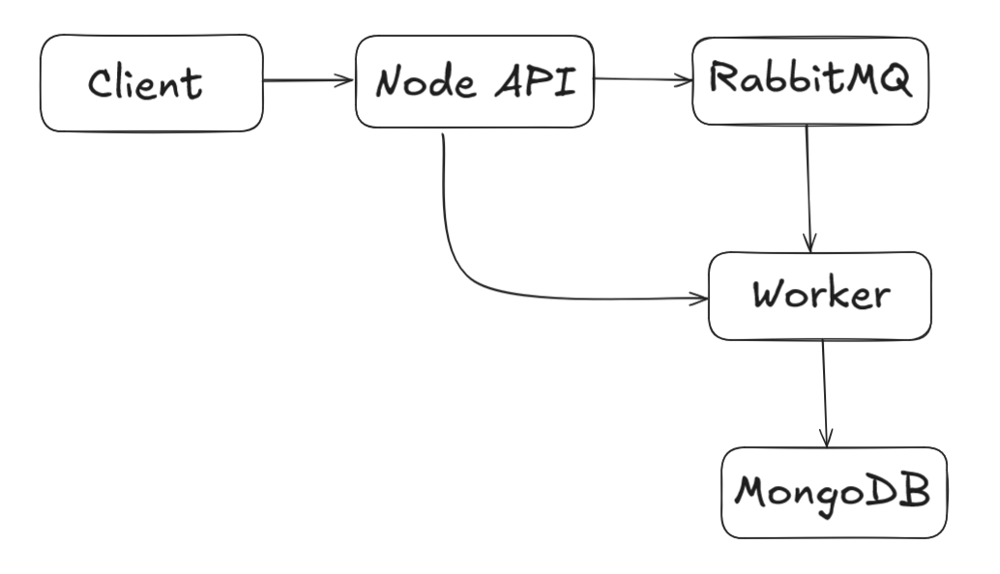
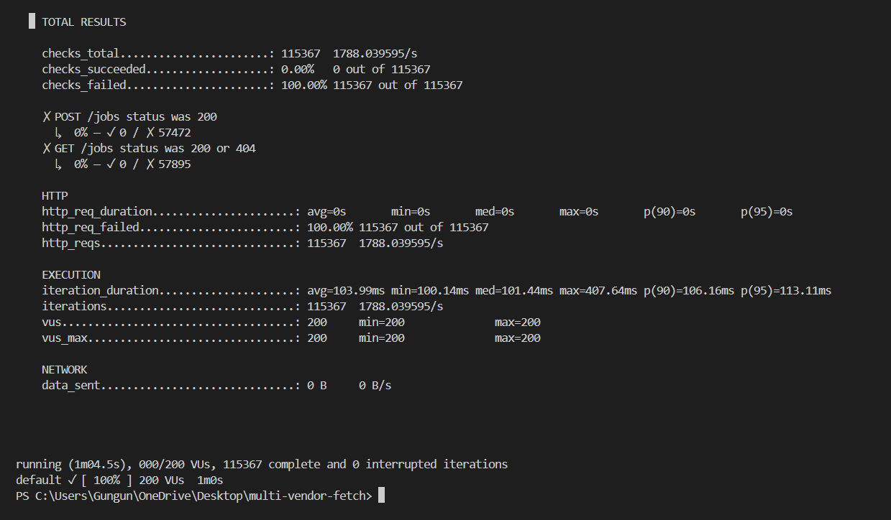

# 🛠 Multi-Vendor Data Fetch Service

A Node.js backend with MongoDB, RabbitMQ, and Docker. It accepts jobs, fetches data from vendors (sync & async), rate-limits calls, cleans data, and stores final results.


## 🚀 Steps to Run System Locally

-  Clone & install
```
git clone https://github.com/inosgungun/Multi-Vendor-Data-Fetch-Service.git
cd Multi-Vendor-Data-Fetch-Service
npm install
```

-  Start RabbitMQ 
```
docker run -d --hostname rabbitmq-host --name rabbitmq -p 5672:5672 -p 15672:15672 rabbitmq:3-management
```

-  Start MongoDB
```
docker run -d -p 27017:27017 --name mongodb mongo
```

-  Start Backend Server
```
npm start
```

-  Start Background Worker
```
node workers/worker.js
```


## 🛠 Requirements

- Docker
- Visual Studio Code or any code editor

##  🏛 Tiny architecture diagram




## 🖼️ Test API's

#### 🧪 **Step 1: POST /jobs**
**Purpose:** create a new job → get `request_id`
- URL:- http://localhost:3000/jobs
- Body → raw → JSON: { "sample": "test" }
- 


#### 🧪 **Step 2: GET /jobs/{requestId}**
**Purpose:** create a new job → get `request_id`
- URL:- http://localhost:3000/jobs
- Body → raw → JSON: { "sample": "test" }
-  


## ⚙️ Key design decisions / trade-offs

- Used **RabbitMQ** for decoupling & async processing.
-   Added **rate-limiter** (p-limit) to never break vendor limits.
-   Simple **MongoDB schema** to store job status & cleaned data.
-   Two mock vendors (sync & async) to simulate real-world cases.  
-   Worker updates job status from `pending` → `processing` → `complete/failed`.

##  Load Test
```
docker run -v ${PWD}:/src grafana/k6 run /load-test.js
```
